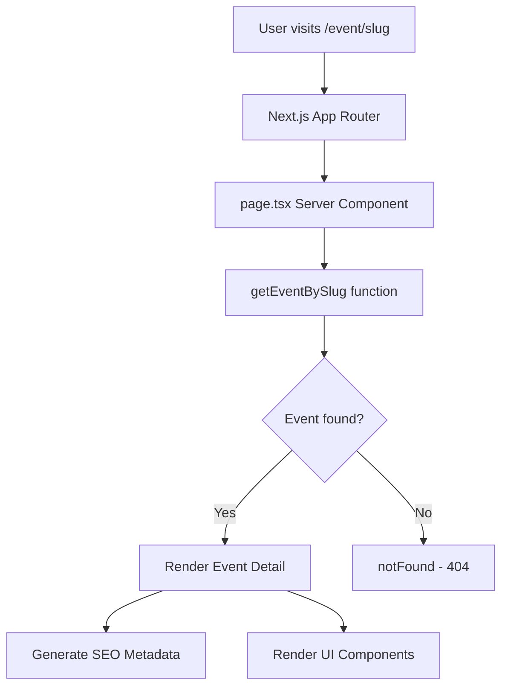
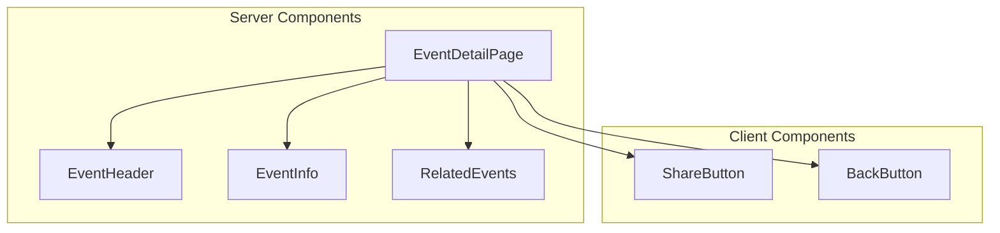

# Design Document: AI Event Detail Page

## Overview

Halaman detail event AI (`/event/[slug]`) menampilkan informasi lengkap sebuah event. Halaman ini menggunakan pola Server Component dari Next.js 16 untuk optimal SEO dan performance, mengikuti pattern yang sudah ada di project detail page (`/project/[slug]`).

Fase pertama menggunakan data mock dari `lib/data/mock-events.ts`. Arsitektur dirancang untuk mudah dimigrasi ke Supabase di fase berikutnya.

## Architecture

### Route Structure

```
app/event/[slug]/
├── page.tsx          # Server Component - main page
├── loading.tsx       # Loading skeleton
└── not-found.tsx     # 404 page (optional, uses Next.js default)
```

### Data Flow



### Component Architecture



## Components and Interfaces

### 1. EventDetailPage (Server Component)

Main page component yang menghandle data fetching dan layout.

```typescript
// app/event/[slug]/page.tsx
interface EventDetailPageProps {
  params: Promise<{ slug: string }>
}

export default async function EventDetailPage({ params }: EventDetailPageProps) {
  const { slug } = await params
  const event = getEventBySlug(slug)
  
  if (!event) {
    notFound()
  }
  
  const relatedEvents = getRelatedEvents(event.category, event.id)
  
  return (
    // ... render layout
  )
}
```

### 2. Data Fetching Functions

```typescript
// lib/events-utils.ts (extend existing file)

/**
 * Get event by slug from mock data
 */
export function getEventBySlug(slug: string): AIEvent | undefined {
  return mockEvents.find(event => event.slug === slug)
}

/**
 * Get related events by category, excluding current event
 */
export function getRelatedEvents(
  category: EventCategory, 
  excludeId: string, 
  limit: number = 3
): AIEvent[] {
  return mockEvents
    .filter(event => event.category === category && event.id !== excludeId)
    .slice(0, limit)
}
```

### 3. ShareButton (Client Component)

```typescript
// components/event/share-button.tsx
'use client'

interface ShareButtonProps {
  eventTitle: string
  eventSlug: string
}

export function EventShareButton({ eventTitle, eventSlug }: ShareButtonProps) {
  // Copy link to clipboard functionality
  // Show toast notification on success
}
```

### 4. SEO Metadata Generation

```typescript
// app/event/[slug]/page.tsx
import type { Metadata } from 'next'

export async function generateMetadata({ params }: EventDetailPageProps): Promise<Metadata> {
  const { slug } = await params
  const event = getEventBySlug(slug)
  
  if (!event) {
    return {
      title: 'Event Not Found | AI Events Indonesia'
    }
  }
  
  return {
    title: `${event.name} | AI Events Indonesia`,
    description: event.description.slice(0, 160),
    openGraph: {
      title: event.name,
      description: event.description.slice(0, 160),
      images: [event.coverImage],
      type: 'website'
    }
  }
}
```

## Data Models

### Existing AIEvent Interface (types/events.ts)

```typescript
export interface AIEvent {
  id: string
  slug: string
  name: string
  date: string           // Format: YYYY-MM-DD
  time: string           // Format: HH:mm
  endDate?: string       // Optional end date
  endTime?: string       // Optional end time
  locationType: EventLocationType  // 'online' | 'offline' | 'hybrid'
  locationDetail: string
  description: string
  organizer: string
  registrationUrl: string
  coverImage: string
  category: EventCategory  // 'workshop' | 'meetup' | 'conference' | 'hackathon'
  status: EventStatus      // 'upcoming' | 'ongoing' | 'past'
}
```

### Helper Types

```typescript
// Format tanggal untuk display
interface FormattedEventDate {
  date: string      // "15 Feb 2025"
  time: string      // "09:00"
  endDate?: string  // "16 Feb 2025"
  endTime?: string  // "17:00"
  isMultiDay: boolean
}

// Location display info
interface LocationDisplay {
  type: EventLocationType
  typeLabel: string  // "Online", "Offline", "Hybrid"
  detail: string
  icon: 'globe' | 'map-pin' | 'video'
}
```

## UI Layout

### Desktop Layout (lg+)

```
┌─────────────────────────────────────────────────────────────┐
│ Navbar                                                       │
├─────────────────────────────────────────────────────────────┤
│ ← Back to Events                                             │
├─────────────────────────────────────────────────────────────┤
│ ┌─────────────────────────────────────┐ ┌─────────────────┐ │
│ │                                     │ │ Event Info Card │ │
│ │         Cover Image (16:9)          │ │ - Date/Time     │ │
│ │                                     │ │ - Location      │ │
│ └─────────────────────────────────────┘ │ - Organizer     │ │
│                                         │ - Category      │ │
│ ┌─────────────────────────────────────┐ │ - Status        │ │
│ │ Event Title                         │ │                 │ │
│ │ [Category Badge] [Status Badge]     │ │ [Register CTA]  │ │
│ │                                     │ │                 │ │
│ │ Description...                      │ │ [Share Button]  │ │
│ │                                     │ └─────────────────┘ │
│ └─────────────────────────────────────┘                     │
├─────────────────────────────────────────────────────────────┤
│ Related Events (3 cards)                                     │
├─────────────────────────────────────────────────────────────┤
│ Footer                                                       │
└─────────────────────────────────────────────────────────────┘
```

### Mobile Layout

```
┌─────────────────────────┐
│ Navbar                  │
├─────────────────────────┤
│ ← Back to Events        │
├─────────────────────────┤
│ ┌─────────────────────┐ │
│ │   Cover Image       │ │
│ │     (16:9)          │ │
│ └─────────────────────┘ │
│                         │
│ Event Title             │
│ [Category] [Status]     │
│                         │
│ 📅 Date/Time            │
│ 📍 Location             │
│ 👤 Organizer            │
│                         │
│ Description...          │
│                         │
│ [Register Now - Full W] │
│ [Share Button]          │
├─────────────────────────┤
│ Related Events          │
│ (horizontal scroll)     │
├─────────────────────────┤
│ Footer                  │
└─────────────────────────┘
```


## Correctness Properties

*A property is a characteristic or behavior that should hold true across all valid executions of a system—essentially, a formal statement about what the system should do. Properties serve as the bridge between human-readable specifications and machine-verifiable correctness guarantees.*

### Property 1: Slug Lookup Returns Correct Event

*For any* valid event slug in the mock data, calling `getEventBySlug(slug)` should return the event object where `event.slug === slug`.

**Validates: Requirements 1.1**

### Property 2: Date Formatting Handles All Combinations

*For any* AIEvent object, the date formatting function should:
- Always produce a valid formatted date string
- Include end date/time in output if `endDate` is present
- Correctly identify multi-day events when `endDate !== date`

**Validates: Requirements 1.4**

### Property 3: Past Events Have Disabled Registration

*For any* AIEvent with `status === 'past'`, the registration CTA should be rendered in a disabled or hidden state.

**Validates: Requirements 3.4**

### Property 4: Metadata Generation Follows Format

*For any* AIEvent object, the generated metadata should:
- Have title matching format `${event.name} | AI Events Indonesia`
- Have description that is a substring of `event.description` (truncated to max 160 chars)
- Have og:image equal to `event.coverImage`

**Validates: Requirements 5.1, 5.2, 5.3, 5.4**

### Property 5: Invalid Slugs Return Not Found

*For any* string that is not a valid slug in the mock data, `getEventBySlug(slug)` should return `undefined`, triggering a 404 response.

**Validates: Requirements 6.1**

### Property 6: Related Events Filtering

*For any* AIEvent, the `getRelatedEvents(category, excludeId, limit)` function should:
- Return only events where `event.category === category`
- Never include the event with `event.id === excludeId`
- Return at most `limit` events (default 3)

**Validates: Requirements 9.2, 9.3**

## Error Handling

### 1. Event Not Found (404)

```typescript
// app/event/[slug]/page.tsx
import { notFound } from 'next/navigation'

export default async function EventDetailPage({ params }) {
  const { slug } = await params
  const event = getEventBySlug(slug)
  
  if (!event) {
    notFound() // Triggers Next.js 404 page
  }
  
  // ... render event
}
```

### 2. Image Loading Error

```typescript
// Handle broken cover images with fallback
<Image
  src={event.coverImage}
  alt={event.name}
  onError={(e) => {
    e.currentTarget.src = '/placeholder.jpg'
  }}
/>
```

### 3. External Link Safety

```typescript
// Registration URL opens in new tab with security attributes
<a
  href={event.registrationUrl}
  target="_blank"
  rel="noopener noreferrer"
>
  Register Now
</a>
```

## Testing Strategy

### Unit Tests

Unit tests untuk fungsi-fungsi utility:

1. **getEventBySlug**
   - Test dengan slug yang valid
   - Test dengan slug yang tidak ada
   - Test dengan empty string

2. **getRelatedEvents**
   - Test filtering by category
   - Test exclusion of current event
   - Test limit parameter

3. **Date formatting functions**
   - Test single day event
   - Test multi-day event
   - Test event tanpa end time

### Property-Based Tests

Property-based tests menggunakan library seperti `fast-check`:

1. **Property 1**: Slug lookup correctness
   - Generate random events, verify lookup returns correct event

2. **Property 4**: Metadata format validation
   - Generate random event data, verify metadata follows format

3. **Property 6**: Related events filtering
   - Generate random events and categories, verify filtering rules

### Integration Tests (Playwright)

1. **Page rendering**
   - Visit `/event/[valid-slug]` → page renders with correct data
   - Visit `/event/[invalid-slug]` → 404 page shown

2. **User interactions**
   - Click share button → link copied to clipboard
   - Click back button → navigates to `/event/list`
   - Click register button → opens external URL

3. **Responsive layout**
   - Test on mobile viewport
   - Test on tablet viewport
   - Test on desktop viewport

### Test Configuration

```typescript
// Property-based test example with fast-check
import fc from 'fast-check'
import { getEventBySlug } from '@/lib/events-utils'
import { mockEvents } from '@/lib/data/mock-events'

describe('Event Detail - Property Tests', () => {
  // Feature: ai-event-detail, Property 1: Slug lookup returns correct event
  it('should return correct event for any valid slug', () => {
    fc.assert(
      fc.property(
        fc.constantFrom(...mockEvents.map(e => e.slug)),
        (slug) => {
          const event = getEventBySlug(slug)
          return event !== undefined && event.slug === slug
        }
      ),
      { numRuns: 100 }
    )
  })
})
```
