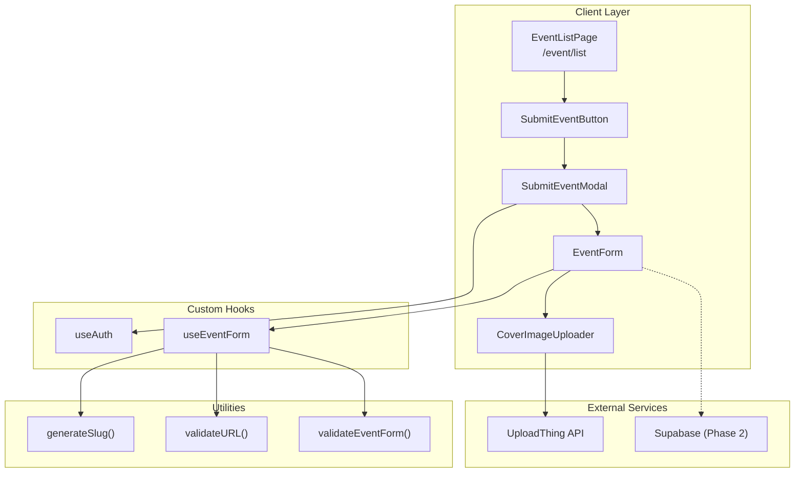

# Dokumen Design: Submit Event Modal

## Overview

Submit Event Modal adalah fitur yang memungkinkan pengguna terotentikasi untuk mengirimkan event AI baru melalui form modal popup. Fitur ini dibangun di atas komponen Dialog yang sudah ada dan mengikuti pola yang sama dengan SubmitProjectForm untuk konsistensi UX.

Arsitektur menggunakan pendekatan Phase 1 (UI only dengan mock submission) yang dapat dengan mudah diintegrasikan dengan Supabase di Phase 2.

## Architecture



## Components dan Interfaces

### 1. SubmitEventButton

Tombol trigger untuk membuka modal, ditempatkan di section bawah event list.

```typescript
interface SubmitEventButtonProps {
  onClick: () => void
  disabled?: boolean
}
```

### 2. SubmitEventModal

Komponen modal utama yang menggunakan Dialog dari Radix UI.

```typescript
interface SubmitEventModalProps {
  open: boolean
  onOpenChange: (open: boolean) => void
  userId?: string
}
```

### 3. EventForm

Form untuk input data event dengan validasi.

```typescript
interface EventFormProps {
  onSubmit: (data: EventFormData) => Promise<void>
  isLoading: boolean
  userId: string
}

interface EventFormData {
  name: string
  slug: string
  date: string
  time: string
  locationType: EventLocationType
  locationDetail: string
  description: string
  organizer: string
  registrationUrl: string
  coverImage: string
  category: EventCategory
  status: 'upcoming'
  approved: false
  submitted_by: string
}
```

### 4. CoverImageUploader

Komponen untuk upload gambar via UploadThing atau input URL.

```typescript
interface CoverImageUploaderProps {
  value: string
  onChange: (url: string) => void
  onError: (error: string) => void
  disabled?: boolean
}

type ImageInputMode = 'upload' | 'url'
```

### 5. useEventForm Hook

Custom hook untuk mengelola state dan validasi form.

```typescript
interface UseEventFormReturn {
  formData: Partial<EventFormData>
  errors: Record<string, string>
  isValid: boolean
  isLoading: boolean
  setField: (field: keyof EventFormData, value: any) => void
  validateForm: () => boolean
  resetForm: () => void
  handleSubmit: () => Promise<SubmitResult>
}

interface SubmitResult {
  success: boolean
  error?: string
}
```

## Data Models

### EventFormData (Extended AIEvent)

```typescript
// Extends existing AIEvent type
interface EventFormData extends Omit<AIEvent, 'id' | 'endDate' | 'endTime'> {
  approved: boolean
  submitted_by: string
}

// For Phase 2 Supabase integration
interface EventsTableRow {
  id: string // UUID, auto-generated
  slug: string
  name: string
  date: string // ISO date string
  time: string // HH:mm format
  location_type: 'online' | 'offline' | 'hybrid'
  location_detail: string
  description: string
  organizer: string
  registration_url: string
  cover_image: string
  category: 'workshop' | 'meetup' | 'conference' | 'hackathon'
  status: 'upcoming' | 'ongoing' | 'past'
  approved: boolean
  submitted_by: string // UUID, references auth.users
  created_at: string // timestamp
  updated_at: string // timestamp
}
```

### Validation Schema

```typescript
interface ValidationRule {
  required?: boolean
  pattern?: RegExp
  message: string
}

const eventValidationRules: Record<keyof EventFormData, ValidationRule[]> = {
  name: [{ required: true, message: 'Nama event wajib diisi' }],
  date: [{ required: true, message: 'Tanggal event wajib diisi' }],
  time: [{ required: true, message: 'Waktu event wajib diisi' }],
  locationType: [{ required: true, message: 'Tipe lokasi wajib dipilih' }],
  locationDetail: [{ required: true, message: 'Detail lokasi wajib diisi' }],
  description: [{ required: true, message: 'Deskripsi event wajib diisi' }],
  organizer: [{ required: true, message: 'Nama penyelenggara wajib diisi' }],
  registrationUrl: [
    { required: true, message: 'URL registrasi wajib diisi' },
    { pattern: /^https?:\/\/.+/, message: 'URL registrasi harus format URL yang valid' }
  ],
  coverImage: [{ required: true, message: 'Cover image wajib diisi' }],
  category: [{ required: true, message: 'Kategori event wajib dipilih' }]
}
```


## Correctness Properties

*A property is a characteristic or behavior that should hold true across all valid executions of a system—essentially, a formal statement about what the system should do. Properties serve as the bridge between human-readable specifications and machine-verifiable correctness guarantees.*

### Property 1: Slug Generation Consistency

*For any* valid event name string, the slug generator SHALL produce a URL-friendly slug that:
- Contains only lowercase letters, numbers, and hyphens
- Has no leading or trailing hyphens
- Has no consecutive hyphens

**Validates: Requirements 2.2**

### Property 2: Status Default Value

*For any* submitted event form data, the status field SHALL always be set to 'upcoming' regardless of other field values.

**Validates: Requirements 2.5**

### Property 3: File Size Validation

*For any* file upload attempt where file size exceeds 10MB, the Cover_Image_Uploader SHALL reject the upload and return an error.

**Validates: Requirements 3.3**

### Property 4: Image Input Mode Selection

*For any* sequence of image input operations (upload or URL), the final coverImage value SHALL be the result of the last successful operation.

**Validates: Requirements 3.4**

### Property 5: Required Field Validation

*For any* form submission attempt where at least one required field is empty or missing, the Event_Validator SHALL:
- Return validation failure
- Include error message for each empty required field
- Prevent form submission

**Validates: Requirements 4.1, 4.3, 4.4**

### Property 6: URL Format Validation

*For any* registrationUrl input that does not match a valid URL pattern (starting with http:// or https://), the Event_Validator SHALL return a validation error for that field.

**Validates: Requirements 4.2**

### Property 7: Approval Status Default

*For any* successfully submitted event, the approved field SHALL always be set to false.

**Validates: Requirements 5.1**

### Property 8: User Attribution

*For any* successfully submitted event, the submitted_by field SHALL contain the ID of the authenticated user who submitted the form.

**Validates: Requirements 1.3, 5.4**

## Error Handling

### Form Validation Errors

| Error Type | Condition | User Message |
|------------|-----------|--------------|
| Required Field Empty | Field value is empty/undefined | "{Field name} wajib diisi" |
| Invalid URL Format | registrationUrl doesn't match URL pattern | "URL registrasi harus format URL yang valid" |
| File Too Large | Upload file > 10MB | "Ukuran file maksimal 10MB" |
| Upload Failed | UploadThing returns error | "Gagal mengupload gambar. Silakan coba lagi." |
| Invalid Image URL | URL doesn't return valid image | "URL gambar tidak valid" |

### Submission Errors

| Error Type | Condition | User Message |
|------------|-----------|--------------|
| Not Authenticated | User not logged in | "Silakan login terlebih dahulu untuk submit event" |
| Network Error | API call fails | "Terjadi kesalahan jaringan. Silakan coba lagi." |
| Server Error | Backend returns 5xx | "Terjadi kesalahan server. Silakan coba lagi nanti." |

### Error Display Strategy

1. **Field-level errors**: Displayed below each input field with red text
2. **Form-level errors**: Displayed in alert box above submit button
3. **Toast notifications**: Used for submission success/failure feedback

## Testing Strategy

### Unit Tests

Unit tests focus on specific examples and edge cases:

1. **Slug Generator**
   - Empty string input
   - String with special characters
   - String with multiple spaces
   - String with leading/trailing spaces

2. **URL Validator**
   - Valid HTTP URL
   - Valid HTTPS URL
   - Invalid URL (no protocol)
   - Invalid URL (malformed)

3. **Form Validator**
   - All fields valid
   - Single required field missing
   - Multiple required fields missing
   - Invalid URL with other fields valid

### Property-Based Tests

Property tests verify universal properties across all inputs using a property-based testing library (e.g., fast-check for TypeScript).

Configuration:
- Minimum 100 iterations per property test
- Each test tagged with: **Feature: submit-event-modal, Property {number}: {property_text}**

| Property | Test Description |
|----------|------------------|
| Property 1 | Generate random strings, verify slug output format |
| Property 2 | Generate random form data, verify status is always 'upcoming' |
| Property 3 | Generate random file sizes, verify rejection for >10MB |
| Property 5 | Generate form data with random empty fields, verify validation catches all |
| Property 6 | Generate random strings, verify URL validation correctness |
| Property 7 | Generate valid form data, verify approved is always false |
| Property 8 | Generate submissions with random user IDs, verify submitted_by matches |

### Integration Tests

1. **Modal Open/Close Flow**
   - Open modal when authenticated
   - Close modal via X button
   - Close modal via outside click

2. **Form Submission Flow**
   - Fill all fields → Submit → Verify toast and redirect
   - Fill with invalid data → Submit → Verify errors shown

3. **Image Upload Flow**
   - Upload valid image → Verify preview shown
   - Switch to URL input → Verify URL used
   - Upload oversized file → Verify error shown
